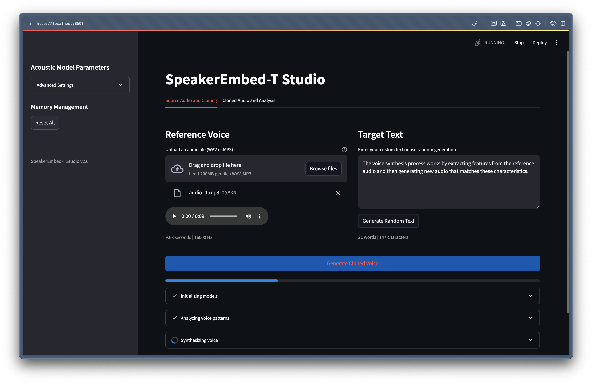
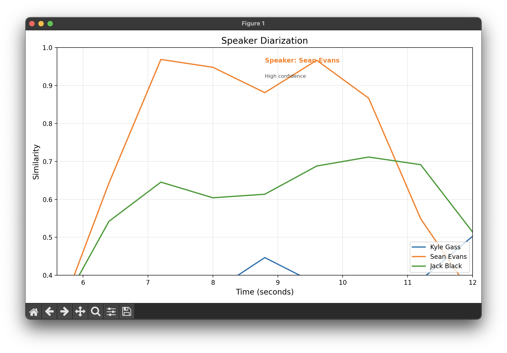

# SpeakEmbed-T : Transformer Based Speaker Encoder for Voice Cloning & Speaker Diarisation Suite

The **SpeakEmbed-T: Transformer Based Speaker Encoder** project is a research-driven toolkit for learning robust speaker representations from speech. At its core is a transformer-based speaker encoder, designed for high-accuracy speaker verification, voice cloning, and speaker diarisation.


This repository provides a full pipeline: from data preprocessing and model training to real-time inference for voice cloning and diarisation.


```
⚠️ Ethical Warning: Deepfake Technology & Model Access Restrictions

This project involves deepfake voice synthesis technology. To mitigate risks of misuse, we have only provided pretrained encoder weights up to step 73,000. Some files and model checkpoints may not be included for ethical and security reasons. Use this repository responsibly and in accordance with applicable laws and ethical guidelines.
```

## File & Data Requirements

For training, evaluation, and demo, the following data structure is expected:

- **Raw Audio Data:** Place in `datasets/LibriSpeech/train-clean-100/`
- **Processed Data:** Saved in `data/processed_data/`
- **Pretrained Models:** Provided in `models/speech_encoder_transformer_updated/`, `models/synthesizer/`, and `models/vocoder/`
- **Demo Audio:** Example files in `test/` and `visualisations/`
- **Speaker Diarisation Demo:** Uses `visualisations/demo_speaker_diarisation.mp3`


## Features

### 1. **Speaker Encoder**
- **Hybrid Convolutional-Transformer Architecture:**
  - The model begins with a stack of convolutional layers that operate on mel-spectrogram inputs, extracting local spectral features and capturing short-term temporal dependencies. These convolutional blocks are responsible for learning robust, noise-invariant representations of the speech signal, and for reducing the temporal resolution to make subsequent processing more efficient.
  - The output of the convolutional stack is then passed to a series of transformer encoder blocks. Each transformer block employs multi-head self-attention to model long-range dependencies and global context across the entire utterance. This allows the model to capture speaker characteristics that manifest over both short and long time scales, which is critical for distinguishing between speakers in real-world, variable-length utterances.
  - Positional encodings (learnable or sinusoidal) are added to the convolutional output to retain temporal ordering, ensuring the transformer can reason about the sequence structure.
  - After the transformer layers, mean pooling is applied across the time dimension to produce a fixed-dimensional embedding vector for each utterance. This is followed by a linear projection and L2 normalization, resulting in a unit-length speaker embedding (d-vector) suitable for downstream tasks.

- **Generalized End-to-End (GE2E) Loss:**
  - The model is trained using the GE2E loss, which is specifically designed for speaker verification. Instead of optimizing for speaker classification, GE2E directly shapes the embedding space so that utterances from the same speaker are close together, while utterances from different speakers are far apart.
  - During training, each batch contains multiple speakers and multiple utterances per speaker. The model computes centroids for each speaker and uses cosine similarity to compare each utterance embedding to all centroids. The loss encourages embeddings to be close to their own speaker centroid and distant from others, with learnable similarity scaling and bias parameters.
  - This approach enables dynamic adaptation to intra-speaker variability, implicit hard negative mining, and robust generalization to unseen speakers and short utterances.

- **Noise-Robust Preprocessing Pipeline:**
  - Audio is first resampled and normalized, then converted to mel-spectrograms using a short-time Fourier transform (STFT) with phase-aware processing. This enhances robustness to background noise and channel effects.
  - An adaptive voice activity detection (VAD) module is applied to remove non-speech frames and preserve low-energy phonemes, which are important for speaker identity.
  - The preprocessing pipeline is streaming-capable, supporting frame-wise processing with as low as 20ms latency, making it suitable for real-time and low-resource applications.

- **L2-normalized Embeddings:**
  - The final speaker embedding is L2-normalized, ensuring all embeddings lie on the unit hypersphere. This facilitates efficient similarity computation (cosine similarity reduces to a dot product) and improves clustering and verification performance.


- **Advantages:**
  - Captures both local and global speech characteristics for robust speaker representation
  - Efficient parallel processing and scalable to long utterances
  - Directly optimized for verification, not just identification
  - Robust to noise, short utterances, and real-world variability

### 2. **Voice Cloning Pipeline**
- **Reference Audio → Speaker Embedding:** Extracts voice identity from a short audio sample.
- **Text-to-Speech Synthesis:** Generates mel-spectrograms from text, conditioned on the speaker embedding.
- **Neural Vocoder:** Converts spectrograms to high-fidelity audio.

### 3. **Speaker Diarisation**
- **Continuous Embedding Extraction:** Slides a window over long audio to compute speaker embeddings over time.
- **Reference Matching:** Compares segments to reference speaker embeddings for diarisation.
- **Interactive Visualisation:** Animated similarity curves and audio playback for diarisation results.

### 4. **Modern Streamlit UI**
- **Upload reference audio and input text for instant voice cloning.**
- **Switch between Transformer and LSTM encoders for comparison.**
- **Download and listen to cloned audio.**
- **Advanced settings for synthesis and vocoder options.**


## Research Context & Innovations

Speaker recognition and voice synthesis are foundational to modern speech systems, enabling applications such as personalized assistants, secure authentication, and adaptive TTS. The foundational work of Jia et al. (2018) established the use of LSTM-based speaker encoders for d-vector extraction in multi-speaker synthesis, but faced limitations in capturing both global and local speech patterns and in real-world robustness.

**Our Unified Convolutional-Transformer Architecture** addresses these limitations through three key innovations:

- **Hierarchical Feature Extraction:**
  - Convolutional layers first extract local spectral features, followed by transformer blocks that model long-range dependencies. This enables richer, more comprehensive speaker representations and efficient parallel processing, overcoming the sequential bottlenecks of LSTMs.

- **End-to-End GE2E Training:**
  - Unlike softmax-based classification, our system uses Generalized End-to-End (GE2E) loss, directly optimizing the embedding space for verification. This brings dynamic centroid computation, implicit hard negative mining, and learnable similarity margins, resulting in superior speaker discrimination and robustness, especially for unseen speakers, short utterances, and noisy environments.

- **Robust Preprocessing Pipeline:**
  - Combines mel-spectrograms with phase-aware processing and adaptive VAD, preserving low-energy phonemes and enabling streaming-capable frame processing with 20ms latency. This is a significant improvement over conventional MFCC-based pipelines.

Our approach bridges the gap between foundational LSTM-based systems and modern transformer advances, demonstrating how strategic integration of attention mechanisms, improved training objectives, and robust preprocessing can enhance speaker embedding quality without compromising efficiency.

## Example Results

**Voice Cloning:**  
*Input:* 5s reference audio  
*Output:* Synthesized speech in the same voice, from arbitrary text.

**Speaker Diarisation:**  
*Input:* Multi-speaker audio  
*Output:* Interactive plot showing speaker turns, with audio playback.


## Installation and Setup

1. **Clone the repository and navigate to the root directory:**
    ```bash
    git clone <repo-url>
    cd SpeakEmbed-T
    ```

2. **Install dependencies:**
    ```bash
    pip install -r requirements.txt
    ```

3. **(Optional) Download or prepare LibriSpeech data for training.**


## How to Run

### 1. **Voice Cloning Demo (Streamlit UI)**

- **Start the app:**
    ```bash
    streamlit run app.py
    ```
- **Open your browser at:**
    ```
    http://localhost:8501
    ```

    

- **Steps:**
    - Upload a reference audio (WAV/MP3, ideally 5–20 seconds).
    - Enter or generate text to synthesize.
    - Click "Generate Cloned Voice" to hear the result.
    - Download the output or compare with the original.

### 2. **Speaker Diarisation Demo**

- **Run the diarisation script:**
    ```bash
    python visualisations/speaker_diarisation.py
    ```
    

- **Follow the prompts:**
    - Provide an audio file and mark reference segments for each speaker.
    - The script computes embeddings and visualises speaker turns over time.

### 3. **Training and Evaluation**

- **Preprocess data:** (see `data_preprocessing/`)
- **Train the encoder:** (see `demo/training_encoder_v2.ipynb` or `scripts/speech_encoder_v2_updated.py`)
- **Evaluate embeddings:** Use `demo/encoder_projection.ipynb` for visualisation and clustering.


## Technology Stack

- **PyTorch** (deep learning, model training)
- **Streamlit** (interactive UI)
- **Librosa, torchaudio** (audio processing)
- **scikit-learn, numpy, matplotlib** (analysis & visualisation)


## Troubleshooting

- **Model Not Found:** Ensure pretrained weights are in the correct `models/` subfolders.
- **Audio Errors:** Use clean, single-speaker audio for best results.
- **Streamlit UI Issues:** Clear browser cache or restart the app if UI elements do not load.
- **CUDA/Device Issues:** The code will fall back to CPU if GPU is unavailable, but training/inference will be slower.


## Legal Attribution

The speaker encoder builds on the Real-Time Voice Cloning toolkit by Corentin Jemine and the GE2E loss from Google. This project extends those works with a transformer-based encoder, improved training, and modern UI.

## Repository Move Notice
>
> This repository hosts the current, active development of the project and captures all the latest updates. It was migrated from a private repository to streamline organization and improve long-term maintainability.
